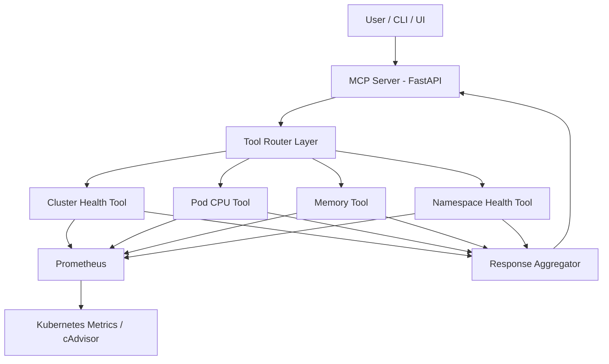

# 🚀 MCP-Based Kubernetes Cluster Health Platform

A lightweight **MCP-style observability layer** that provides unified, structured insights into Kubernetes cluster health using Prometheus metrics.

This project exposes cluster telemetry (CPU, memory, restarts, pod health) through a **tool-based API layer**, enabling both machine and user-driven queries.

---

## 📌 Problem Statement

Kubernetes clusters generate large volumes of metrics via Prometheus, but:
- Data is fragmented across dashboards and queries
- Engineers must manually write PromQL
- No unified “cluster health API” exists

---

## 💡 Solution

This project introduces an **MCP-inspired tool layer** that:
- Abstracts Prometheus queries into reusable tools
- Provides structured cluster health responses
- Normalizes CPU, memory, and pod metrics
- Enables future integration with CLI / chatbot / automation systems

---

## 🏗️ Architecture

---
##⚙️ Tech Stack
 - Python 3.11
 - FastAPI
 - Prometheus (metrics backend)
 - Kubernetes (target system)
 - Docker
 - (Optional) Kubernetes deployment

---

🔧 Core Features
📊 Cluster Observability
CPU usage per pod
Memory usage per pod (MB)
Restart counts
Namespace-level aggregation

🧠 Tool-Based MCP Design
cluster_health
pod_cpu_health
pod_memory_health
namespace_health
📦 Structured JSON Output
Machine-readable responses
Ready for dashboards or automation

📥 Example Request

{
  "action": "cluster_health",
  "cluster": "prod"
}

📤 Example Response

{
  "cluster": "prod",
  "status": "Degraded",
  "score": 72,
  "cpu_usage": [
    {
      "namespace": "default",
      "pod": "api-1",
      "value": "0.62 cores"
    }
  ],
  "memory_usage": [
    {
      "namespace": "default",
      "pod": "api-1",
      "value": "512 MB"
    }
  ],
  "alerts": [
    "High CPU usage in api-1",
    "Pod restarts detected in worker-2"
  ]
}

📊 PromQL Examples Used

CPU Usage

sum(rate(container_cpu_usage_seconds_total{container!="", pod!=""}[5m])) by (namespace, pod)

Memory Usage

sum(container_memory_usage_bytes{container!="", pod!=""}) by (namespace, pod) / 1024 / 1024
